# Настройка VPN

## Содержание
- [Часть 0. Введение](#часть-0-введение)
- [Часть 1. Настройка ПК](#часть-1-настройка-пк)
  - [Часть 1а. Первоначальна настройка](#часть-1а-первоначальна-настройка)
  - [Часть 1б. Выбор приложений для VPN](#часть-1б-выбор-приложений-для-vpn)
  - [Часть 1в. Настройка автозапуска](#часть-1в-настройка-автозапуска)
- [Часть 2. Настройка телефона](#часть-2-настройка-телефона)
  - [Часть 2а. Первоначальна настройка](#часть-2а-первоначальна-настройка)
  - [Часть 2б. Выбор приложений для VPN](#часть-2б-выбор-приложений-для-vpn)
- [Часть 3. Проверка (обязательная)](#часть-3-проверка-обязательная)

## Часть 0. Введение
Для подключения будут использоваться ссылки подписки. Профили будут автоматически обновлятся, а сами ссылки будут постоянными и индивидуальными для каждого пользователя и устройства.

Для пк:
```
https://sukvetka.isgood.host:16496/thisissub/АдресВашейПочты_PC
```
Для телефона: 
```
https://sukvetka.isgood.host:16496/thisissub/АдресВашейПочты_Phone
```

## Часть 1. Настройка ПК
### Часть 1а. Первоначальна настройка
- [Скачайте по ссылке](https://github.com/KaringX/karing/releases/download/v1.2.2.844/karing_1.2.2.844_windows_x64.exe) и установите "Karing". В конце установки **уберите** галочку "Запустить Karing":

<div align="center">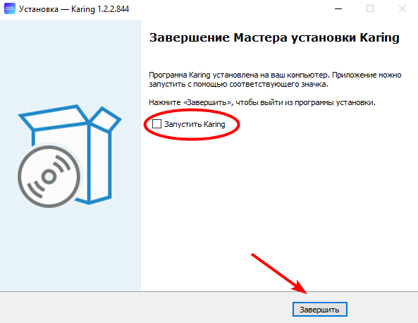</div>

- Перейдите в папку с установленным клиентом
- Поставьте галочку "Запускать эту программу от имени администратора" в свойствах "karing.exe"

<div align="center">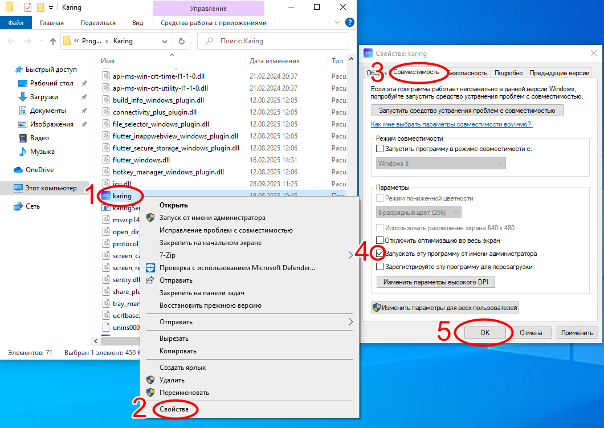</div>

- [Скачайте по ссылке](https://github.com/AlivE-git/IfYouKnowYouKnow/raw/refs/heads/main/_Karing_Autorun.bat) скрипт "_Karing_Autorun.bat", и положите в папку с "karing.exe"
- Запустите скрипт от имени администратора
- Введите "4" и нажмите Enter для удаления задач автозапуска старых клиентов
- Закройте скрипт
- Запустите "Karing"
- Выберите русский язык, и прокликайте дальше, пока не попадете в меню "Добавить 
профиль":

<div align="center">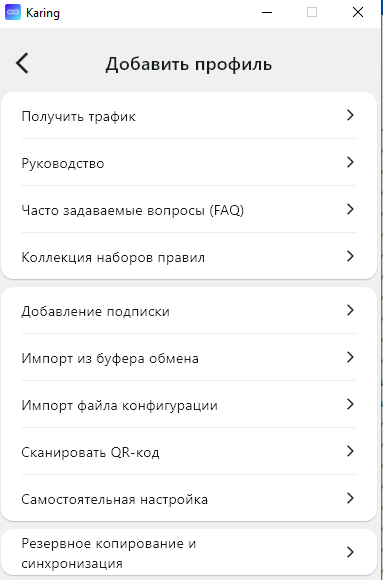</div>

- Выберите "Резервное копирование и синхронизация" -> "Импорт и экспорт в файл" -> "Импорт из URL" -> вставьте ссылку указанную ниже и нажмите Ок

```
https://github.com/AlivE-git/IfYouKnowYouKnow/raw/refs/heads/main/Karing_1.2.2.844_PC_config.zip
```
- Согласитесь с перезаписью, и после получения сообщения об успешном импорте вернитесь в меню "Добавить профиль"
- Выберите "Добавление подписки"
- В поле "Ссылка на подписку/содержание" вставьте **ВАШУ** ссылку для ПК :

<div align="center">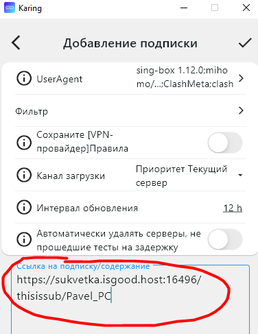</div>

- Нажмите галочку сверху справа, для сохранения подписки
- Нажмите два раза стрелочку сверху слева, для возврата в главное окно:

<div align="center">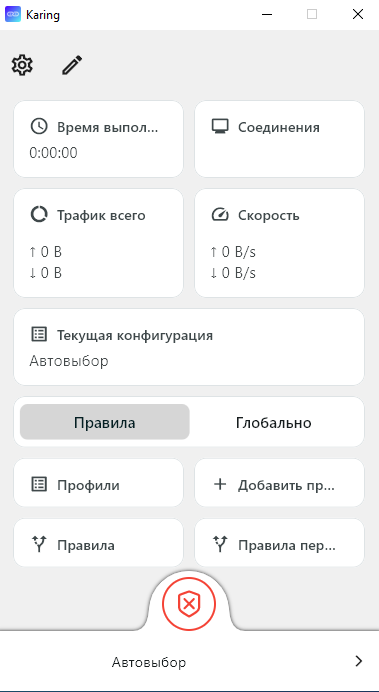</div>

- Нажмите на большую красную кнопку с крестиком внизу окна для подключения. Если кнопка изменилась на зеленую, то настройка выполнена верно

### Часть 1б. Выбор приложений для VPN
- Выберите "Правила перенаправления" в главном окне клиента:

<div align="center">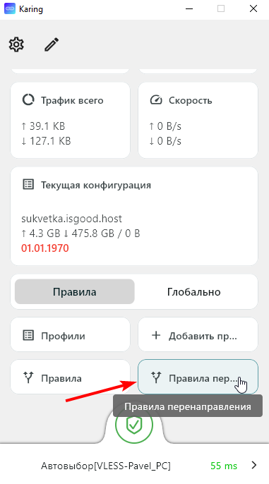</div>

- Нажмите на карандаш сверху справа:

<div align="center">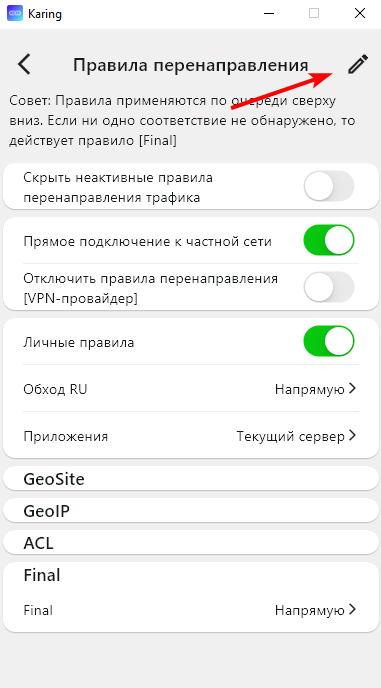</div>

- Нажмите на "Приложения":

<div align="center">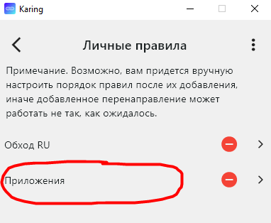</div>

- В поле "Имя процесса" впишите названия exe файлов приложений, которые будут использовать VPN. Для примера там уже вписаны Chrome и Discord. **Соблюдайте регистр букв!**
- Нажмите галочку сверху справа:

<div align="center">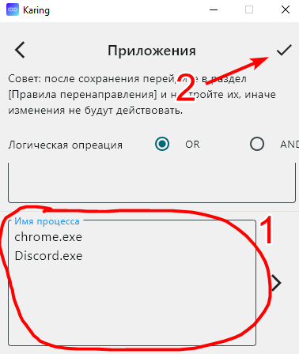</div>

- Вернитесь в главное окно, для применения изменений

### Часть 1в. Настройка автозапуска
Для пользователей Windows 11:
- В главном окне нажмите на шестеренку сверху слева
- Пролистайте до пункта "Запуск при включении", и включите его:

<div align="center">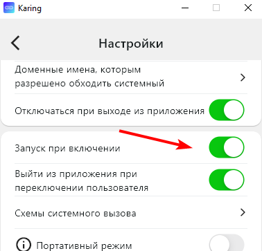</div>

- Вернитесь в главное окно

Для пользователей Windows 10:
- Убедитесь, что у вас **НЕ** включен "Запуск при включении" в самом клиенте, как указанно выше в инструкции для Windows 11
- Запустите "_Karing_Autorun.bat", который ранее был скопирован в папку с "karing.exe"
- Выберите первый пункт
- Закройте скрипт

P.S. при запуске ПК ненадолго будет появляться синее окно PowerShell. Это нормально, пугатьcя не нужно

<details>
  <summary>Пояснение, почему на десятке так, если интересно)</summary>
    В случае некорректного или принудительного завершения работы клиента, не удаляется виртуальный сетевой адаптер TUN режима. Так иногда происходит при выключении ПК. Если адаптер не удален, то при следующем запуске будет ошибка. В Windows 11 с этим проблем нет. Адаптер спокойно пересоздается. Скрипт проверяет наличие этого адаптера, удаляет его, и уже после запускает клиент. 
  </details>
  
## Часть 2. Настройка телефона
### Часть 2а. Первоначальна настройка
- [Скачайте по ссылке](https://github.com/KaringX/karing/releases/download/v1.2.2.844/karing_1.2.2.844_android_arm64-v8a.apk) и установите "Karing"
- Запустите "Karing"
- Выберите русский язык, и прокликайте дальше, пока не попадете в меню "Добавить 
профиль":

<div align="center">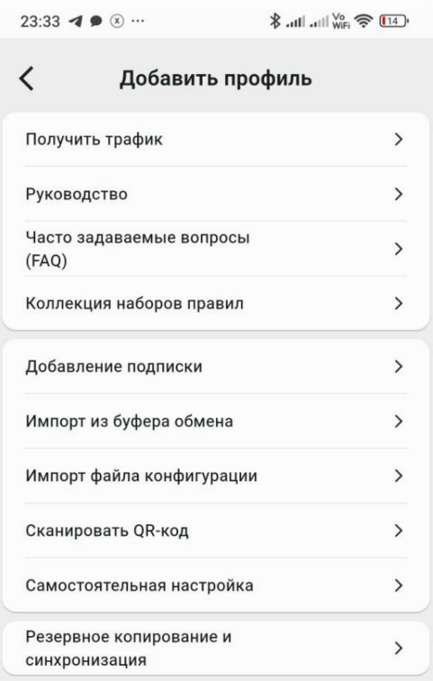</div>

- Выберите "Резервное копирование и синхронизация" -> "Импорт и экспорт в файл" -> "Импорт из URL" -> вставьте ссылку указанную ниже и нажмите Ок

```
https://github.com/AlivE-git/IfYouKnowYouKnow/raw/refs/heads/main/Karing_1.2.2.844_Phone_config.zip
```
- Согласитесь с перезаписью, и после получения сообщения об успешном импорте вернитесь в меню "Добавить профиль"
- Выберите "Добавление подписки"
- В поле "Ссылка на подписку/содержание" вставьте **ВАШУ** ссылку для телефона :

<div align="center">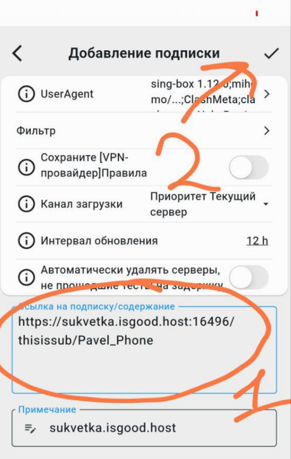</div>

- Нажмите галочку сверху справа, для сохранения подписки
- Нажмите два раза стрелочку сверху слева, для возврата в главное окно:

<div align="center">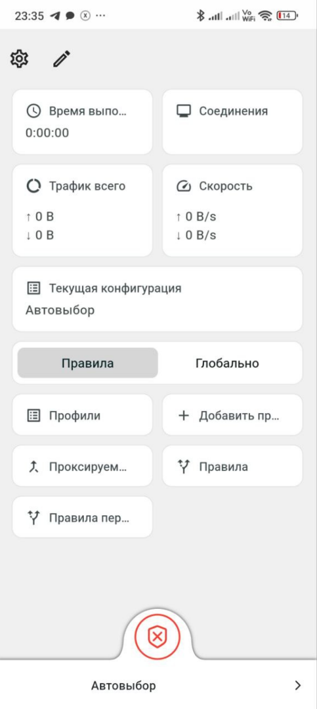</div>

- Нажмите на большую красную кнопку с крестиком внизу окна для подключения. Если кнопка изменилась на зеленую, то настройка выполнена верно

### Часть 2б. Выбор приложений для VPN
- Выберите на главном экране "Проксируемые приложения":

<div align="center">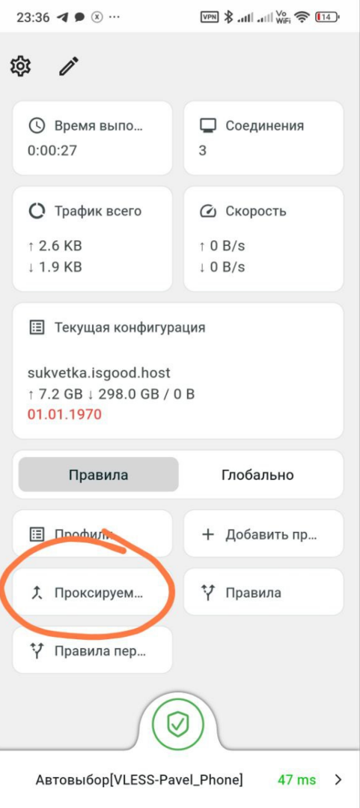</div>

- Убедитесь что выбран режим белого списка и отметьте необходимые приложения. Если не можете найти нужного приложения, попробуйте выключить "Скрыть системные приложения":

<div align="center">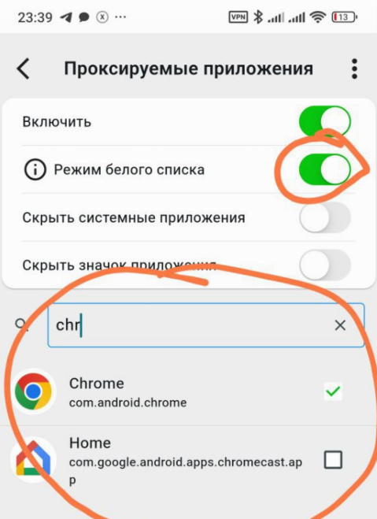</div>

- Вернитесь в главное окно, для применения изменений

  ## Часть 3. Проверка (обязательная).
Действия выполнить и на ПК, и на телефоне:

- Откройте https://2ip.ru/. "Ваше местоположение" должно быть Россия:

<div align="center"></div>

- Откройте https://2ip.io/ ."Ваше местоположение" должно быть "Riga, Latvia":

<div align="center"></div>

Если проверка прошла успешно, то можете начинать пользоваться.
 