# Настройка VPN

## Содержание
- [Часть 0. Введение](#часть-0-введение)
- [Часть 1. Настройка телефона](#часть-2а-настройка-пк)
- [Часть 2. Настройка ПК](#часть-2-настройка-пк)
- [Часть 3. Проверка (обязательная)](#часть-3-проверка-обязательная)
- [Часть 4. Обновление профилей](#часть-4-обновление-профилей)
  - [Обновление профиля в Hiddify на телефоне](#обновление-профиля-в-hiddify-на-телефоне)
  - [Обновление профиля в Nekobox на ПК](#обновление-профиля-в-nekobox-на-пк)

## UPD 09.03.2025
Ребят, если вы уже настраивали "Nekobox" на ПК, необходимо удалить задачу автозагрузки. Теперь для этого есть скрипт, и могут быть конфликты со старой задачей:
- Win+R -> "taskschd.msc" -> "OK"
- Слева в меню нажмите "Библиотека планировщика заданий"
- Найдите в списке "Nekoray" или "Nekobox" -> ПКМ -> "Удалить"

## Часть 0. Введение
Для подключения вам нужно запросить у меня две ссылки профилей. Первая вида "https://sukvetka..../XXX_Phone" - это для телефона, вторая "https://sukvetka..../XXX_PC" - это для ПК. Они индивидуальны для каждого пользователя и устройства, и постоянны. Можете сохранить их в надежном месте. Их нельзя палить кому-либо и где-либо.

## Часть 1. Настройка телефона
- [Скачайте по ссылке](https://github.com/hiddify/hiddify-next/releases/download/v2.5.7/Hiddify-Android-universal.apk) и установите "Hiddify" 
При первом запуске выбрать "Регион" -> "Россия", выключите сбор аналитики,  "Старт":

  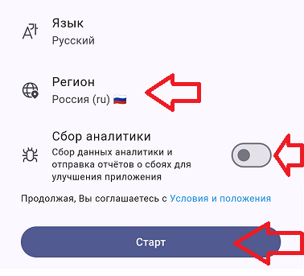

- Скопируйте ссылку из сообщения "https://sukvetka..../XXX_Phone".
Нажмите "Новый профиль" -> "Добавить из буфера обмена":

  

- Откройте меню (сверху слева) -> "Параметры конфигурации":

  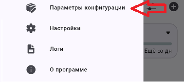

- В группе "Входящие параметры" проверьте, что "Реализация TUN" выбран "gvisor":

  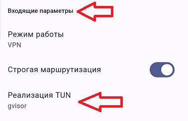

Есть два варианта использования. Первый: VPN всегда включен, и через него работают только выбранные приложения. Второй: VPN включается по необходимости, через него работают все приложения. У меня настроен первый, но здесь опишу оба метода.

### а) VPN всегда включен:
- Откройте меню (сверху слева) -> "Настройки":

  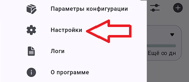

- В разделе "Расширенные" выберите "Раздельное проксирование приложений":

  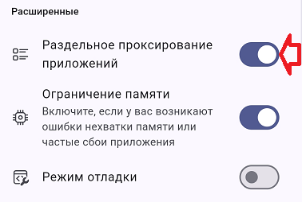

- В открывшемся окне выберите "Проксировать выбранные приложения", и выберите приложения, которые будут работать через VPN (пр. Chrome, Discord, Instagram, Twitter и т.п.). Этот список можно редактировать в любой момент:

  

- Вернитесь на главный экран, и нажмите кнопку подключения.

### б) VPN включается по необходимости:

- Откройте меню (сверху слева) -> "Настройки":

  

- Внизу вылючите пункт "Раздельное проксирование приложений":

  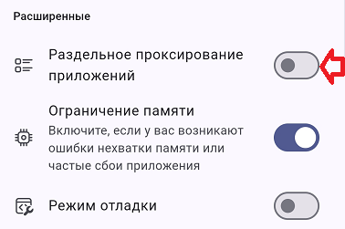

- Вернитесь на главный экран, и нажмите кнопку подключения.

#### [По окончанию настройки, обязательно выполните проверку!!](#часть-3-проверка-обязательная)

## Часть 2. Настройка ПК
- Удалите ПК версию "Hiddify", если он был установлен.
- [Скачайте Nekobox](https://github.com/MatsuriDayo/nekoray/releases/download/4.0.1/nekoray-4.0.1-2024-12-12-windows64.zip), и распакуйте в любое удобное место.
Дополительно [скачайте архив конфигураций](https://github.com/AlivE-git/IfYouKnowYouKnow/raw/refs/heads/main/nekobox_config.zip), и распакуйте в папку с Nekobox.
### Был обнаружен один баг. Чтобы он не возник, нужно сделать некоторое шаманство, но только один раз:
- ПКМ на "nekobox.exe" -> "Свойства";
- "Совместимость" -> "Запускать эту программу от имени администратора" -> уберите галочку, если она есть -> "Применить" -> "Ок";;
- Запуститите "nekobox.exe";
- Приложение запускается свернутым в трей. Нажмите для раза по иконке, чтобы открыть окно:

  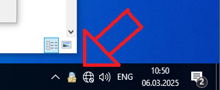

- Нажмите галочку "Режим TUN";

  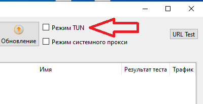
- Приложение попросит запустить его с правами администратора -> нажмите "Yes";
- Проверьте что появилась галочка на "Режим TUN";
- Закройте "Nekobox" (в трее ПКМ по иконке -> "Выход");
- ПКМ на "nekobox.exe" -> "Свойства";
- "Совместимость" -> "Запускать эту программу от имени администратора" -> поставьте галочку -> "Применить" -> "Ок";
- Запустите "nekobox.exe" -> снова поставьте галочку "Режим TUN";

Самое сложное позади :)

- Скопируйте ссылку из сообщения "https://sukvetka..../XXX_Phone".

- "Программа" -> "Добавить профиль из буфера обмена":

  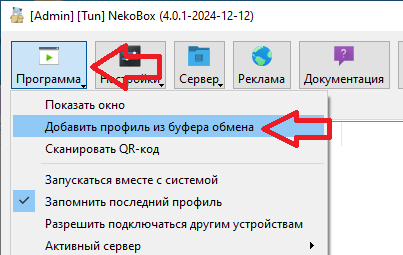

- В окне выбрать "Как подписку (создать новую группу)" -> "ОК"

  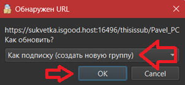

- "Настройки" -> "Группы".

  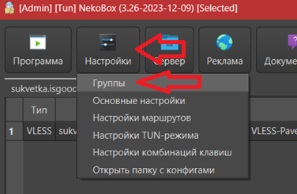

- Удалите группу "По умолчанию":

  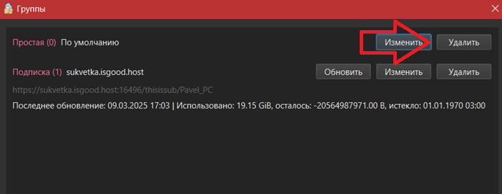

- В главном окне нажмите ПКМ на профиль -> "Запустить":

  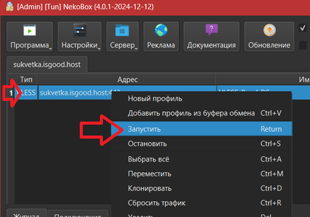

- Для изменнеия списка приложений, которые будут использовать VPN, выберете "Настройки" -> "Настройки TUN-режима".

  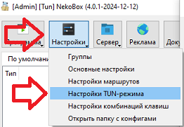

- В правом списке укажите имена "exe" файлов программ. Там уже добавлен "Discord" в качестве примера:

  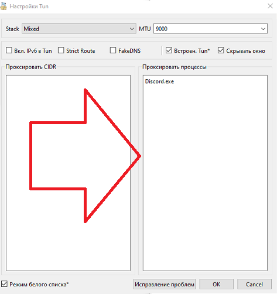

- И чтобы "Nekobox" запускался автоматически, запустите "Nekobox_Autostart.bat" из папки с программой. Описывать смысла нет, там всё интуитивно понятно.
 
- Так же, не забудьте удалить/отключить VPN расширения в браузере, если они у вас есть.

#### [По окончанию настройки, обязательно выполните проверку!!](#часть-3-проверка-обязательная)

## Часть 3. Проверка (обязательная).
Действия выполнить и на ПК, и на телефоне:

- Откройте https://2ip.ru/. "Ваше местоположение" должно быть Россия:

  

- Откройте https://2ip.io/ ."Ваше местоположение" должно быть "Riga, Latvia":

  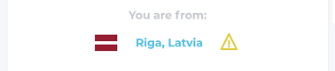

Если проверка прошла успешно, то можете начинать пользоваться.

## Часть 4. Обновление профилей

Т.к. теперь работает система подписок, в случае изменение настроек на стороне сервера, вам достаточно обновить профили в пару кликов.

### Обновление профиля в Hiddify на телефоне
- Нажмите кпоку "обновить" слева от добавленного профиля:

  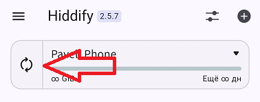

- По окончанию вы получите сообщение "Профиль успешно обновлён". Всё :)

#### [По окончанию обновления, обязательно выполните проверку!!](#часть-3-проверка-обязательная)

### Обновление профиля в Nekobox на ПК

- ПКМ по профилю в главном окне -> "Остановить":

  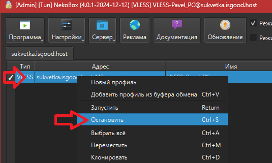

- "Настройки" -> "Группы":

  

- "Обновить":

  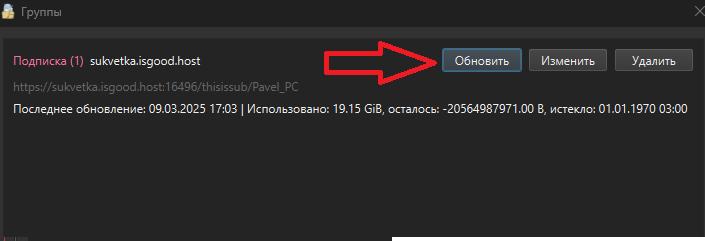

- Вернитесь в главное окно, ПКМ по профилю -> "Запустить":

  

  #### [По окончанию обновления, обязательно выполните проверку!!](#часть-3-проверка-обязательная)
